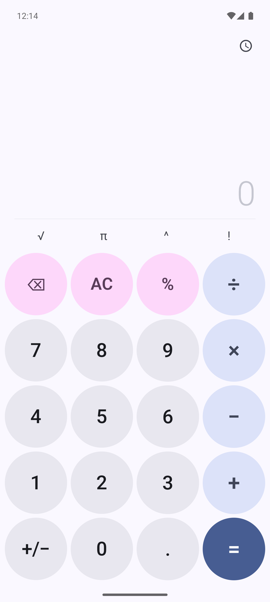
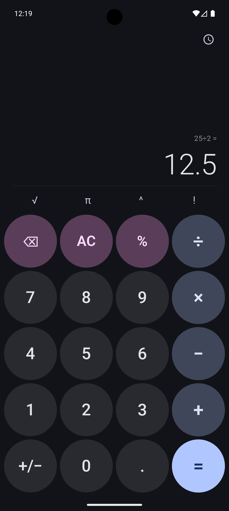
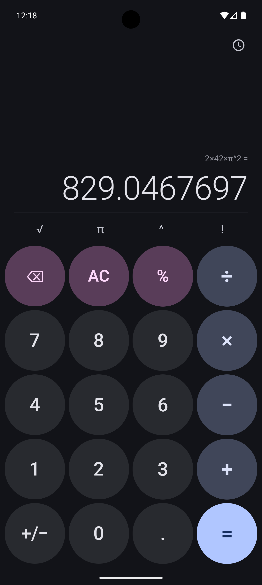
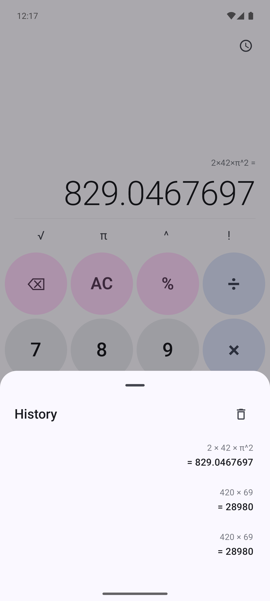
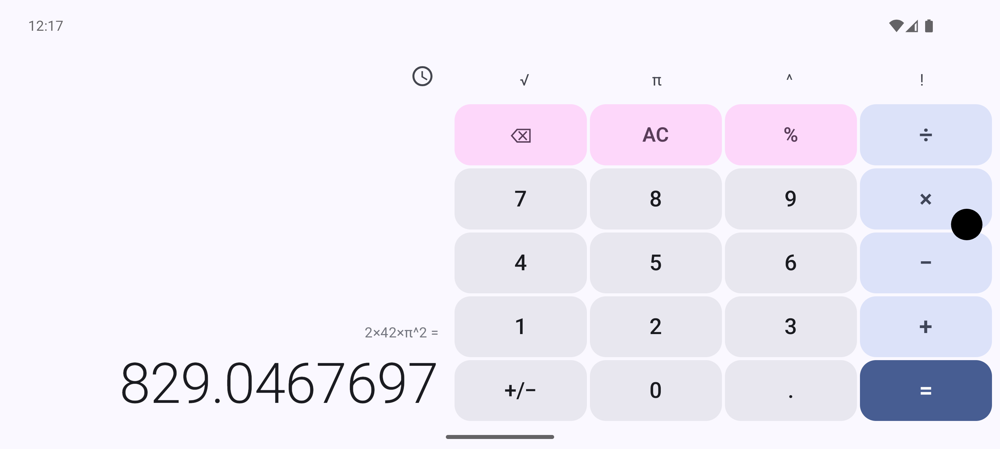
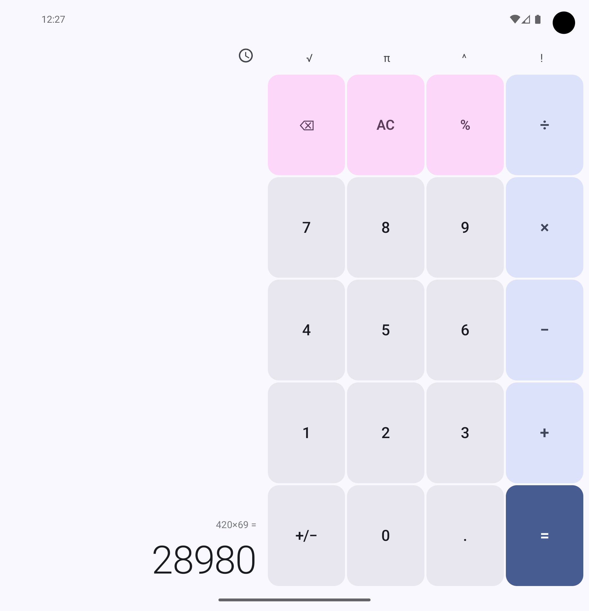

# CalculatorM3
A clean, private calculator that never collects your data.

Every calculation you make is your business — not Big Tech's. Calculator M3 is a beautifully designed calculator built with Material 3 Expressive that works entirely offline with zero data collection, zero analytics, and zero network permissions.
Unlike Google Calculator, this app doesn't phone home. No usage tracking, no telemetry, no ad frameworks buried in the code. It does one thing and does it well: math.

## Screenshots

  
  
  
  

  
  

## Features

- Full expression evaluation with parentheses and operator precedence
- Live result preview as you type
- Scientific functions — square root, pi, power, factorial
- Calculation history — persists across restarts
- Expression cursor — tap to edit mid-expression
- Dynamic color theming that matches your wallpaper (Android 12+)
- Automatic light and dark mode
- Adaptive layout — portrait, landscape, and foldable support
- Haptic feedback and smooth animations
- Completely offline — no internet permission required

## What you don't get

- Tracking
- Analytics
- Ads
- Data harvesting

Built with Kotlin and Jetpack Compose. Open source. Your calculations stay on your device, period.
