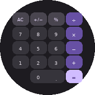

  
    
  <h1>CalculatorM3</h1>

  
A clean, private calculator that never collects your data.

   

  <!-- Screenshots -->
  <table>
    <tr>
      <td align="center"> Light Theme</td>
      <td align="center"> Dark Theme</td>
      <td align="center"> Scientific Functions</td>
      <td align="center"> Calculation History</td>
    </tr>
  </table>

   

  <table>
    <tr>
      <td align="center"> Landscape Mode</td>
      <td align="center"> Foldable Support</td>
    </tr>
  </table>

---

## Features
- Full expression evaluation with parentheses and operator precedence
- Live result preview as you type
- Scientific functions — square root, pi, power, factorial
- Calculation history — persists across restarts
- Expression cursor — tap to edit mid-expression
- Dynamic color theming that matches your wallpaper (Android 12+)
- Automatic light and dark mode
- Adaptive layout — portrait, landscape, and foldable support
- Haptic feedback and smooth animations
- Completely offline — no internet permission required

---

## Privacy

Every calculation you make is your business — not Big Tech's. Calculator M3 is a beautifully designed calculator built with Material 3 Expressive that works entirely offline with zero data collection, zero analytics, and zero network permissions.

Unlike Google Calculator, this app doesn't phone home. No usage tracking, no telemetry, no ad frameworks buried in the code. It does one thing and does it well: math.

- No tracking
- No analytics
- No ads
- No data harvesting

---

## Built With

- **Kotlin** + **Jetpack Compose**
- **Material 3** Expressive design system
- **BigDecimal** high-precision arithmetic

---

## 🔑 Checksums

| Algorithm  | GitHub Release |
|------------|----------------|
| **MD5**    | <!-- md5 -->`56620d76df1208cb92e581f46eec81b1`<!-- /md5 --> |
| **SHA1**   | <!-- sha1 -->`637b99085e5c1dfe069a35552221f73b27f481ec`<!-- /sha1 --> |
| **SHA-256**| <!-- sha256 -->`024bb05ad63da4e08e5933e6984ba756eaafaa7cb3f2ff5e5eda3db0637e37b5`<!-- /sha256 --> |

---

## License

    CalculatorM3

    Copyright (c) 2025-2026

    This program is free software: you can redistribute it and/or modify
    it under the terms of the GNU General Public License as published by
    the Free Software Foundation, either version 3 of the License, or
    (at your option) any later version.

    This program is distributed in the hope that it will be useful,
    but WITHOUT ANY WARRANTY; without even the implied warranty of
    MERCHANTABILITY or FITNESS FOR A PARTICULAR PURPOSE. See the
    GNU General Public License for more details.

    You can find a copy of the GNU General Public License v3 here https://www.gnu.org/licenses/

---

Your calculations stay on your device, period.

