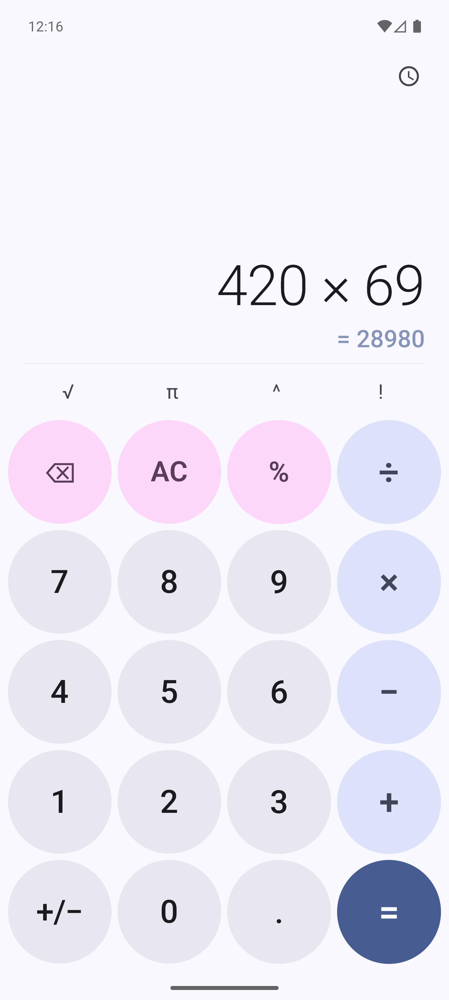
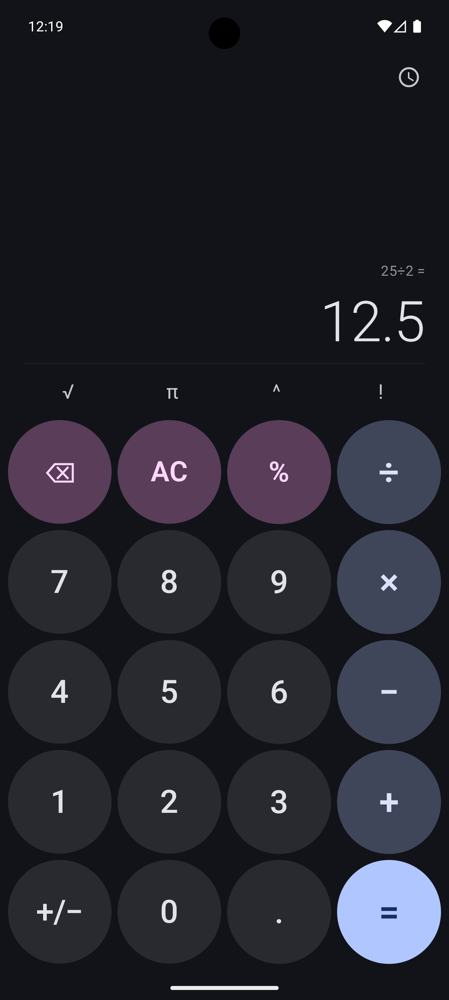
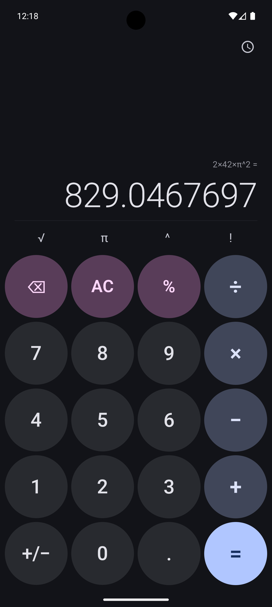
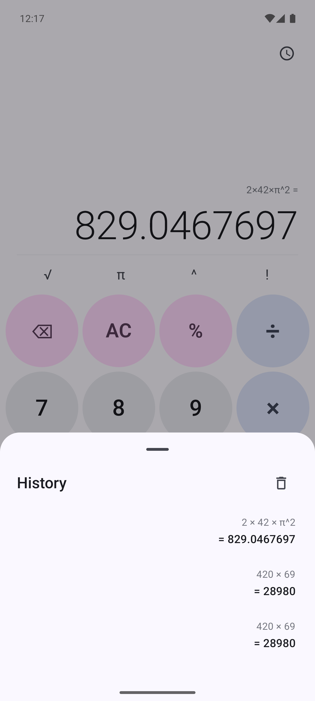
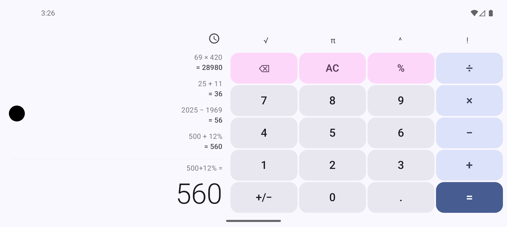
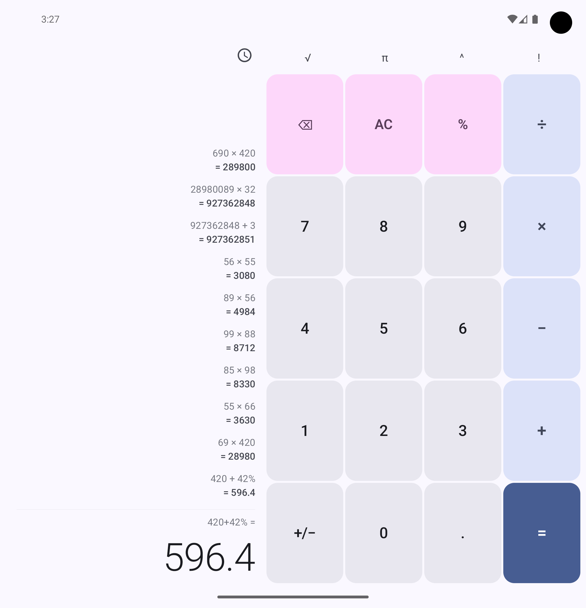
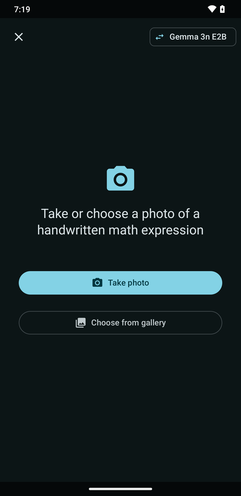
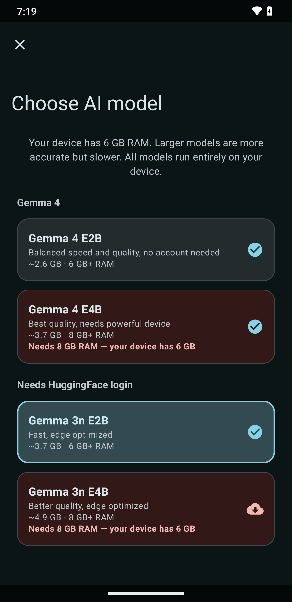
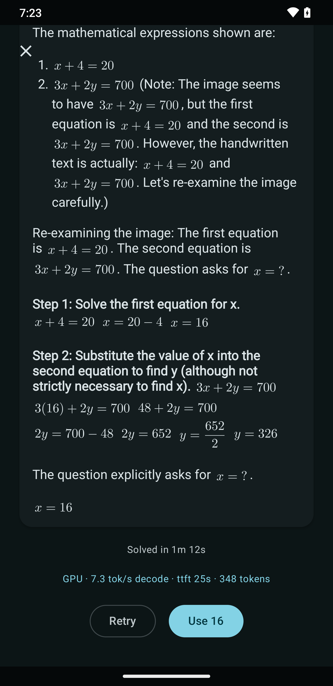

  
    
  <h1>CalculatorM3</h1>

  
A clean, private calculator that never collects your data.

   

  <!-- Screenshots -->
  <table>
    <tr>
      <td align="center"> Light Theme</td>
      <td align="center"> Dark Theme</td>
      <td align="center"> Scientific Functions</td>
      <td align="center"> Calculation History</td>
    </tr>
  </table>

   

  <table>
    <tr>
      <td align="center"> Landscape Mode</td>
      <td align="center"> Foldable Support</td>
    </tr>
  </table>

   

  <table>
    <tr>
      <td align="center"> AI Math Solver</td>
      <td align="center"> On-Device Models</td>
      <td align="center"> Solved On-Device</td>
    </tr>
  </table>

---

## Features
- Full expression evaluation with parentheses and operator precedence
- Live result preview as you type
- Scientific functions — square root, pi, power, factorial
- Calculation history — persists across restarts
- Expression cursor — tap to edit mid-expression
- **AI Math Solver** — photograph handwritten math and solve it on-device (experimental; hidden until you unlock it — see below)
- Dynamic color theming that matches your wallpaper (Android 12+)
- Automatic light and dark mode
- Adaptive layout — portrait, landscape, and foldable support
- Haptic feedback and smooth animations

---

## AI Math Solver

Point your camera at a handwritten math expression and let an on-device AI model solve it for you. Everything runs locally — no data leaves your device.

> **The AI Math Solver is hidden by default.** To reveal it, rapidly tap **AC** seven times — the same idea as Android's "tap Build number 7 times" to unlock developer options. A countdown toast guides the final taps, and once unlocked a camera icon appears in the top-left corner. The unlock is remembered across restarts.

**How it works:**
1. Unlock the feature (see above), then tap the camera icon (top-left)
2. Choose and download an AI model (one-time, ~2.6–4.9 GB; the download runs in a background service and survives the screen turning off). Gated models (Gemma 3n) first prompt a one-tap **Sign in with Hugging Face**
3. Take a photo with your camera, or choose an existing photo from your gallery
4. The model solves it entirely on-device — GPU-accelerated where supported — and streams its working, rendered with proper math formatting
5. Tap "Use" to insert the answer into the calculator

**Available models:**

All models are vision-capable and run on Google's [LiteRT-LM](https://github.com/google-ai-edge/LiteRT-LM) on-device engine.

| Model | Download | Min RAM | Auth |
|-------|----------|---------|------|
| Gemma 4 E2B | ~2.6 GB | 6 GB | — |
| Gemma 3n E2B | ~3.7 GB | 6 GB | HuggingFace sign-in |
| Gemma 4 E4B | ~3.7 GB | 8 GB | — |
| Gemma 3n E4B | ~4.9 GB | 8 GB | HuggingFace sign-in |

**Requirements:**
- Android device with 6+ GB RAM — the smallest model (Gemma 4 E2B) needs 6 GB and the larger E4B models need 8 GB; on devices with less, the solver shows a "not enough RAM" notice
- A camera or gallery app (photos are taken via the system camera — no in-app camera permission required)
- Internet for the one-time model download (Wi-Fi recommended)
- Gemma 3n models require a free [HuggingFace](https://huggingface.co) account — you sign in once, in-app, and accept the model license; Gemma 4 models need no account ([setup](docs/huggingface-oauth-setup.md))

**Powered by:**
- [Google LiteRT-LM](https://github.com/google-ai-edge/LiteRT-LM) — on-device multimodal LLM inference, GPU-accelerated with automatic CPU fallback

---

## Privacy

Every calculation you make is your business — not Big Tech's. Calculator M3 is a beautifully designed calculator built with Material 3 Expressive with zero data collection and zero analytics.

Unlike Google Calculator, this app doesn't phone home. No usage tracking, no telemetry, no ad frameworks buried in the code.

- No tracking
- No analytics
- No ads
- No data harvesting
- AI models run entirely on-device — no cloud processing
- Internet is only used to download AI models (optional, one-time)

---

## Built With

- **Kotlin** + **Jetpack Compose**
- **Material 3** Expressive design system
- **BigDecimal** high-precision arithmetic
- **System camera + photo picker** for image capture (no in-app camera permission)
- **LiteRT-LM** for on-device multimodal model inference (GPU-accelerated, CPU fallback)
- **WorkManager** foreground service for resumable background model downloads
- **Markwon + jlatexmath** for rendering the answer's math and markdown

---

## License

    CalculatorM3

    Copyright (c) 2025-2026

    This program is free software: you can redistribute it and/or modify
    it under the terms of the GNU General Public License as published by
    the Free Software Foundation, either version 3 of the License, or
    (at your option) any later version.

    This program is distributed in the hope that it will be useful,
    but WITHOUT ANY WARRANTY; without even the implied warranty of
    MERCHANTABILITY or FITNESS FOR A PARTICULAR PURPOSE. See the
    GNU General Public License for more details.

    You can find a copy of the GNU General Public License v3 here https://www.gnu.org/licenses/

---

Your calculations stay on your device, period.

